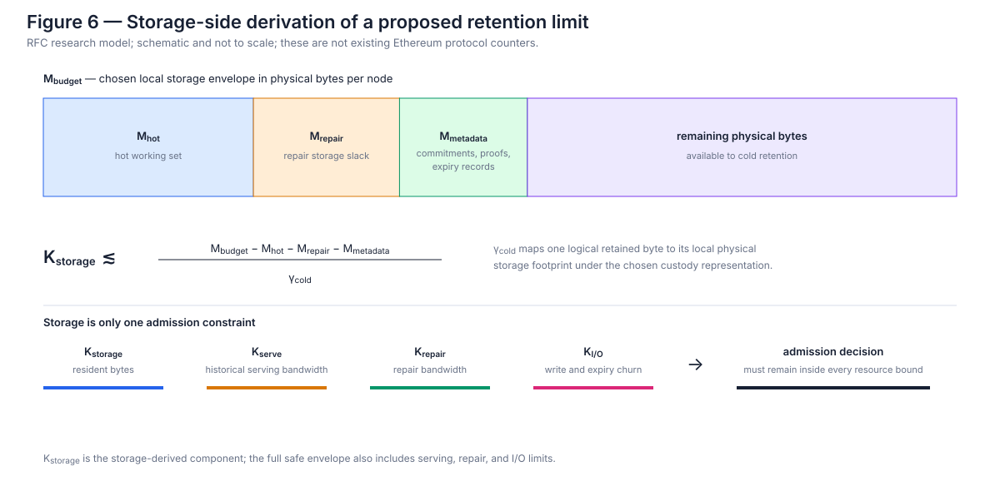

# How are capacity and pricing managed?

## 4. Flow and active retained stock

For a lease that begins on admission, the first-order accounting quantities are flow and active retained stock.

Let `R_t` denote new data entering Ethereum DA around time `t`. This is the **flow** resource: propagation, coding, sampling, and real-time processing.

Let `S_t` denote the total protocol-accounted data currently under an unexpired serving obligation. This is the **active retained stock**. `B` below is a mathematical accounting quantity, not necessarily a user-selectable byte length. For the EIP-4844-compatible path, each admitted commitment contributes the fixed constant `B_blob`, so stock could equivalently be counted in live blob units.

If an object of size `B` is admitted at time `t` with duration `T`, it immediately increases active stock by `B` and remains in `S` until `t+T`. The protocol has to bound two scarce resources independently:

```text
R_t ≤ R_max
```

and

```text
S_t ≤ K_safe,
```

where scalar `K_safe` is a first-order projection of the custody architecture's physical service envelope. §6 expands it into a resource vector.

A lease that begins on admission does not require a separate forward hard-cap curve for storage safety.

To see why, let `S_t(τ)` denote retained obligations that will still be alive at horizon `t+τ`, considering only leases already admitted at `t`. Because those leases can expire but no already-admitted lease begins later,

```text
S_t(τ) ≤ S_t(0) = S_t
     ∀ τ ≥ 0.
```

A new immediate lease of size `B` adds `B` for horizons `0≤τ≤ T`. Therefore, if

```text
S_t + B ≤ K_safe,
```

then the already-contracted retained stock cannot exceed `K_safe` at any later horizon merely because time passes.

Long leases can still crowd out later users, but the capacity they consume is visible **now**. The active-stock cap already counts it. Crowding is an allocation and liveness problem rather than a hidden physical-safety problem.

### 4.1 Non-normative protocol-state sketch

The following toy transition makes the accounting testable. It uses epoch granularity, per-blob retention, and an execution-layer fee with consensus-layer-visible expiry metadata. It deliberately derives the accounting quantity from the fixed blob type rather than accepting a caller-supplied size. Those choices are illustrative rather than an EIP specification.

```text
state:
    retained_bytes: uint64
    expiry_queue[MAX_RETENTION_EPOCHS + 1]: Bucket

Bucket:
    epoch: Epoch
    bytes: uint64

DataObjectMeta:
    commitment: Commitment
    expiry_epoch: Epoch
    enforcement_level: PROTOCOL_REQUIRED

on_epoch_transition(current_epoch):
    bucket = expiry_queue[current_epoch % len(expiry_queue)]
    if bucket.epoch == current_epoch:
        retained_bytes -= bucket.bytes
        bucket = Bucket(epoch=FAR_FUTURE_EPOCH, bytes=0)

admit_blob(commitment, retention_epochs, current_epoch):
    require retention_epochs in ALLOWED_RETENTION_EPOCHS
    require T_min <= retention_epochs <= T_max

    size = BLOB_ACCOUNTING_BYTES
    expiry_epoch = current_epoch + retention_epochs
    require retained_bytes + size <= K_safe

    bucket = expiry_queue[expiry_epoch % len(expiry_queue)]
    require bucket.epoch in {expiry_epoch, FAR_FUTURE_EPOCH}

    retained_bytes += size
    bucket.epoch = expiry_epoch
    bucket.bytes += size

    return DataObjectMeta(
        commitment,
        expiry_epoch,
        PROTOCOL_REQUIRED,
    )
```

The toy binds retention **per blob commitment**, not per transaction. A blob transaction carrying `n` blobs still purchases and pays the existing ingress fee for exactly `n` whole blobs: `blob_gas_used = n · GAS_PER_BLOB`, with the fee determined by the blob base fee. It can supply one duration per commitment or apply one duration to all of them; the resulting `DataObjectMeta` list is committed in the block. The execution layer validates authorization and charges any retention component, while the consensus layer receives each commitment and its absolute expiry through an Engine API payload field or an equivalent consensus-visible container. Size is implicit in the versioned blob type. A consensus client therefore does not need a user-supplied size or arbitrary execution-state reads to determine its duties.

Custody assignment remains deterministic under the relevant DAS design. A node derives whether it must serve a live object's cells from the canonical block, the object metadata, and its custody groups. The obligation holds while `current_epoch < expiry_epoch`.

The counters and ring buffer are part of fork state. A reorganization restores the parent state's `retained_bytes`, expiry buckets, and admitted metadata before applying the competing branch, just as any other consensus state transition would. Implementations may maintain derived indexes for serving, but consensus validity depends only on the committed state.

The sketch leaves several protocol choices open:

- the exact EL/CL container and commitment for `DataObjectMeta`;
- whether continuous epoch values or a small allowed maturity set are exposed;
- which byte-equivalent accounting constant represents one current blob, and how that fixed logical unit expands into storage, serving, repair, and I/O counters;
- whether a future transport should introduce other discrete object sizes, and, if so, its framing and fee rules;
- whether level-2 or level-3 enforcement metadata is ever added;
- how cold custody assignments and repair handoffs are represented.

[The executable stock model](../models/stock.py) implements this transition and reorg snapshots.

---

## 5. Pricing protocol-required byte-time

The equations in this section price an accounting quantity. They do not change EIP-4844 ingress granularity. In the conservative path, substitute `B=B_blob` for each commitment and sum over the transaction's integer number of blobs. An application that uses only part of a blob still incurs the full blob ingress charge and the full-blob retention quantity.

The fee has two parts:

```text
F(B,T)
=
F_ingress(B;R_t)
+
F_ret(B,T;S_t).
```

Ingress prices the immediate flow burden. Retention accounts for a protocol-required amount of **byte-time**.

The null accounting benchmark is:

```text
F_ret(B,T;S_t)
=
B · T · p_ret(u_t),

u_t = S_t / K_target,
```

Here the marginal byte-time price rises as active retained stock approaches its sustainable target. This is a benchmark, not a proposed price mechanism: it ignores the option value of buying a long lease before future scarcity becomes visible.

Candidate pricing mechanisms include:

- plain `B · T · p(S_t)` as the null model;
- convex duration premiums;
- separate base-fee curves for quantized maturities;
- auctioned long-duration capacity;
- admission charges based on expected future scarcity.

The resource-allocation result does not depend on the choice among them. [The pricing model](../models/pricing.py) exposes the alternatives behind one interface so they can be compared under the same inputs.

A hot/cold physical implementation refines this decomposition without changing the logical API. Every object incurs the common cost of fresh dispersal, coding, sampling, and whatever mandatory hot redundancy the DAS design requires. Only the post-transition obligation scales with the purchaser's longer retention choice. Schematically, for total service horizon `T≥ T_hot`,

```text
F(B,T)
≈
F_hot_DA(B;R_t)
+
F_cold(B,T-T_hot;S_t).
```

In a crude linear approximation,

```text
F(B,T)
≈
B · c_hot
+
B · (T - T_hot) · c_cold,
```

The coefficients `c_hot` and `c_cold` summarize two physically different workloads; they are not proposed constants. Neither workload is necessarily linear, and no coding-overhead ratio can be justified before a concrete FullDAS design is fixed. Shorter retention cannot remove the initial hot-path cost. It can remove part of the continuing cold-custody obligation.

The hard cap supplies safety, while the fee market allocates capacity below it. There is no need to price every point on a forward curve for a spot-start lease.

A prepaid fixed-duration lease has one important security property: once accepted, its serving horizon is not contingent on later fee increases. A “rent that must continuously be topped up” is simpler in some respects but changes the service semantics. Under future congestion or censorship, a rollup could lose required retention before its declared security horizon. Continuous rent is therefore better understood as an application-layer or best-effort service unless the entire maximum obligation is admitted up front.

The retention fee should initially be understood as a **scarcity/admission charge on protocol byte-time**, not automatically as compensation to individual custodians. Ethereum can burn the fee while separately enforcing custody duties, just as blob fees need not be direct provider payments. A provider-reward system is a different mechanism. [The hardware and operator-market chapter](11-how-do-hardware-and-da-operator-markets-scale.md) develops one possible `scarcity burn + service procurement` extension without making it part of the base proposal.

### 5.1 What pricing cannot solve

No fee curve guarantees access against a sufficiently wealthy adversary willing to purchase the scarce resource. A high price makes hoarding expensive; it does not create capacity.

This distinction matters because the old forward-curve presentation implicitly asked pricing to do three jobs at once:

1. reflect byte-time scarcity;
2. enforce a physical safety bound;
3. preserve near-term capacity against strategic long leases.

The active-stock cap solves the second. A separately derived reserve can address the third. Pricing can then focus on allocation.

---

## 6. Deriving physical capacity and liveness headroom

The protocol should not begin with an arbitrary `C(τ)`. It should begin with a physical resource envelope.

Let the physical safety envelope be a vector:

```text
K_safe_vector
=
(K_storage, K_serve, K_repair, K_IO).
```

The corresponding live usage vector includes resident bytes, historical request bandwidth, repair bandwidth, and write/expiry churn. Admission must remain inside **every** component:

```text
usage_vector + obligation(blob, T) <= K_safe_vector.
```

Scalar `K_safe` elsewhere in the RFC is a first-order projection onto whichever component is assumed to bind. It is useful for proving the active-stock simplification, but a deployable service cannot assume storage is always the binding resource.

In a concrete DAS design, deriving the vector requires at least:

- erasure-coding expansion;
- the fraction of columns, rows, or cells each node class must custody;
- validator balance-dependent custody requirements;
- repair and re-replication overhead;
- serving bandwidth for historical requests;
- metadata and proof overhead;
- hardware targets and safety margin;
- heterogeneity across clients and node operators.

The protocol still makes a normative choice about what hardware envelope it wants to support, just as it does when choosing blob throughput. But the retained-stock ceiling should be **derived from that envelope**, rather than introduced as an independent market parameter.

The hot/cold design makes that derivation more physical. Let `γ_hot` denote the effective local storage expansion of the transient availability-establishment representation and `γ_cold` the effective local expansion of the sparse retained representation under a chosen custody topology. At throughput `R`, a first-order hot working set is on the order of

```text
M_hot
~
γ_hot · R · T_hot,
```

while the cold resident set is approximately

```text
M_cold
~
γ_cold · S_t.
```

If `M_budget` is the protocol's chosen local storage envelope, then a cold-stock limit should be derived only after reserving the hot working set, repair slack, metadata, and churn margin. Schematically:

```text
K_storage ≲ (M_budget - M_hot - M_repair - M_metadata) / γ_cold.
```



*Figure 6 — Storage-side derivation of a proposed retention limit.* `M_budget` is a chosen local physical-storage envelope; `M_hot`, `M_repair`, and `M_metadata` reserve space for the hot working set, repair slack, and protocol metadata; and `γ_cold` maps a logical retained byte to its local physical footprint. The resulting `K_storage` is only the storage component of the resource vector. These are schematic research quantities, not existing Ethereum protocol counters or proposed parameter values.

No values are proposed for these parameters yet. The vector is still a better research target than an abstract capacity percentage because every term can be measured against a concrete custody and coding design. It also exposes a hardware asymmetry: the hot tier is dominated by write bandwidth, networking, coding, verification, and rapid repair, while the cold tier is dominated by capacity, historical serving, expiry bookkeeping, and slower reconstruct-and-repair.

A second quantity is then useful if Ethereum wants to prevent long leases from consuming the stock capacity reserved for short-duration traffic.

Suppose the protocol wants to preserve the ability to admit at least `r_reserve` bytes per unit time of minimum-retention traffic, where every such byte must remain served for at least `T_min`. A first-order steady-state reserve is:

```text
H_min ≈ r_reserve · T_min.
```

Ordinary longer leases would therefore be limited to approximately:

```text
K_general
=
K_safe - H_min,
```

while the reserved region remains available to the protocol-defined spot/JIT lane.

These numbers are not a finished parameterization. Bursts, repair slack, node churn, and changing ingress limits require additional margins. More importantly, `H_min` protects only a **short-duration resource lane**. An attacker can submit minimum-duration objects too. The reserve prevents long leases from pre-consuming the short lane; it does not preserve honest-user admission when an attacker floods that lane. Ingress limits, pricing, and the inclusion mechanism still decide that fight.

There is an adjacent but structurally cleaner Ethereum design pattern. Draft EIP-8256 separates AOT from JIT flow capacity and includes `JIT_RESERVED`, which AOT reservations cannot consume. A retention reserve borrows that lane-separation idea for stock, but should not inherit stronger anti-censorship or honest-user-liveness claims from it.

---

## 7. Competing physical implementations and deployment fallbacks

Arbitrary continuous `T` can remain the **service abstraction** without committing the physical design to continuous maturities.

There are two qualitatively different ways to make heterogeneous expiry tractable.

### 7.1 Maturity-aligned physical classes

The conservative implementation is to round requested durations into power-of-two epoch maturities—for example, `256, 512, 1,024, 2,048, 4,096` epochs (approximately 1.14, 2.28, 4.55, 9.10, and 18.20 days)—and pack only similar maturities into the same persistent coding domain. Shorter classes such as 1, 8, or 64 epochs can be exposed only if `T_hot` permits them.

This has substantial advantages:

- simple expiry accounting;
- maturity-homogeneous packing;
- bounded metadata;
- predictable repair horizons;
- easier pricing and simulation;
- compatibility with physical representations that cannot become sparse.

Its cost is fragmentation. Capacity can be idle in one maturity class while another is congested, and users lose some allocative precision. A binary version—one ephemeral lane plus one full-retention lane—is the simplest possible experiment.

### 7.2 Renewable short leases

Ethereum could sell only a short base horizon and permit extensions before expiry.

This avoids long prepaid commitments and makes current stock easy to price. But it does **not** reproduce a prepaid long required-serving term. A rollup that must renew under future congestion is exposed precisely when it most values continuity. If renewal capacity is reserved in advance, the design has recreated a future retention commitment under another name.

Renewal is therefore attractive for elastic applications, not a full substitute for an admitted fixed maturity.

### 7.3 Continuously metered rent

A prepaid balance could decay with byte-time until the payer tops it up or a maximum expiry is reached. This is elegant for downstream storage services and receipt-terminated retention, but weakens the base protocol requirement if the service can terminate merely because future prices rise.

### 7.4 Representation-dependent paths

The physical path depends on which DAS representation Ethereum uses. Current 1D PeerDAS with cell-level transport may permit sparse row/cell historical custody without a second coding transition. A future 2D construction introduces cross-row parity coupling and may require a **physical representation change after fresh availability has been established**.

The logical object remains the same committed blob and the application still chooses its serving horizon. Under the hood, however, the network first uses the dense redundancy and repair structure optimized for fast DAS. Once a protocol-recognizable hot phase ends, it discards representation components needed only for fresh availability amplification and keeps an independently reconstructable, independently expiring representation for historical serving.

For a two-dimensional FullDAS-style code, the working design is:

```text
hot dense 2D availability coding
→
cold sparse row-local custody
```

Under current PeerDAS, which does not add the same cross-row second-dimensional parity, the analogous transition is mainly from dense block-wide column-sidecar packaging to sparse cell-level historical serving.

This design family is developed in §17. If it works, it preserves continuous logical lease choice without forcing long-lived and short-lived blobs into separate hot coding domains. If it fails because the richer codeword must remain intact for the entire serving horizon, maturity classes become the natural fallback.

### 7.5 Full variable retention

Arbitrary `T` still maximizes allocative expressiveness and keeps the logical API clean. The physical question is now sharper:

> **Can Ethereum preserve one highly redundant representation only as long as it is needed for fresh availability, then move still-live objects into an independently expirable serving representation without changing their commitments?**

The design order is: **continuous variable retention as the semantic target, 1D cell-level custody as the first prototype path, hot-2D/cold-1D as a possible future compatibility branch, and maturity-aligned classes as the conservative fallback**.

---
