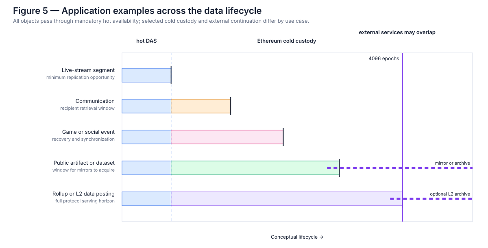

# What does a generalized Ethereum data plane enable?

## 18. High-throughput ephemeral DA

Ephemeral retention does not reduce the live bandwidth needed to establish availability. Gigabytes per second still have to cross the network, be processed, and become reconstructably available. Nor is it practical to reach that throughput by multiplying today's 128 KiB blob objects into hundreds of thousands or millions of objects per slot.

A high-throughput architecture would likely require:

- larger coded DA frames;
- extensive multiplexing;
- ahead-of-time or continuous propagation;
- increasingly fine distributed custody;
- efficient repair;
- batch or aggregate proof verification;
- consensus periodically certifying availability over a continuous data plane;
- markets for ingress;
- explicit accounting for custody through time.

Applications could still submit small logical messages or objects. The underlying transport would batch them into much larger DA structures.

Variable retention is independent of this transport evolution. Its purpose is to prevent an increase in real-time throughput from automatically causing a proportional increase in mandatory long-term storage.

At one gigabyte per second, for example, a one-epoch raw logical retention window—384 seconds, or about 6.4 minutes—corresponds to roughly 384 GB of currently live data. A 4,096-epoch window—about 18.20 days—corresponds to roughly 1.57 PB. Both cases have the same ingress bandwidth and radically different storage obligations.

This distinction becomes increasingly consequential as Ethereum DA moves from megabytes per second toward hundreds of megabytes or gigabytes per second.

Storage is only one frontier. The [backbone-scale appendix](../appendices/backbone-scale-limits.md) derives the matching per-node and aggregate network bounds. It covers shrinking custody fractions, 10,000-node stress cases, object-count explosion, and current PeerDAS cell-proof arithmetic. Its conclusion is stricter: shorter retention does not relax live network conservation.

### 18.1 High-throughput DA does not require a mega-builder

Execution and MEV may centralize block construction for reasons unrelated to DA dissemination. The dangerous design is one in which the winning PBS builder must ingest, encode, and upload the entire DA frame during the slot. That turns a large synchronous uplink into a prerequisite for competitive block building.

The AOT-plus-FullDAS path in §17.9 draws the boundary differently. The builder selects a manifest of rows that have already been dispersed, while row holders and column networks distribute cells and assemble redundancy. The builder can remain specialized in execution ordering without becoming the sole source of every DA byte.

This does not solve builder centralization. [BuilderNet](https://buildernet.org/) explores collaborative multi-node block building, and [multi-party block construction](https://ethresear.ch/t/building-towards-multi-party-block-construction/24975) explores blocks assembled from several builders' contributions. Both show that “one block” need not mean one indivisible construction process, but both introduce their own trust, coordination, latency, and MEV questions.

The limited conclusion is that variable retention and high-throughput DAS do not **inherently** require centralized block production. The publication protocol must simply avoid making the winning builder the only viable DA uplink.

That is a bandwidth claim, not an inclusion-censorship claim. Distributed upload does not force a concentrated PBS builder to select a transaction or blob commitment. The [admission/inclusion analysis in §13.1](03-how-do-future-resource-markets-work.md#131-inclusion-censorship-is-upstream-of-das) separates inclusion censorship, publication-time withholding, and post-inclusion service refusal; a generalized data plane inherits the first problem unless inclusion lists or another robust admission path address it.

---

## 19. Application space

A generalized Ethereum availability market could serve applications whose timing requirements differ sharply.

Examples include:

- rollup DA;
- proof and witness distribution;
- private messaging;
- public authenticated messaging;
- live media;
- broadcast;
- social feeds;
- games;
- oracle and event data;
- agent coordination;
- censorship-resistant publication;
- decentralized-storage bootstrap;
- software distribution;
- arbitrary application data.

The protocol should not encode these as application categories.

Their differences emerge from choices over:

```text
B, T, R
```

and any privacy or routing layers above Ethereum.

A live-media segment may purchase 1–8 epochs—about 6.4–51.2 minutes.

A message may purchase enough time for recipient relays to observe it.

A storage bootstrap object may purchase enough time for a persistent P2P network to acquire it.

A rollup may purchase 256–4,096 epochs—about 1.14–18.20 days—subject to its security minimum.



*Figure 5 — Application examples across the data lifecycle.* Every object crosses the common hot-availability phase. Live media may stop at the minimum; communication and interactive data can select intermediate serving windows; public artifacts can give mirrors time to acquire them; and rollup or L2 data posting can select the full 4,096-epoch horizon. External storage may overlap Ethereum custody and continue afterward. These are examples of resource profiles, not application categories recognized by the protocol.

### 19.1 Experimental application evidence

Two experiments make the non-rollup demand less hypothetical without claiming production readiness:

- [Radio Free Ethereum](https://github.com/bonklek/eth-radio) is an Ethereum blob-radio prototype with a station contract, publishing tools, and a browser tuner that verifies and plays media segments.
- [BlobMail](https://github.com/bonklek/blobmail) is an RFC-stage encrypted-messaging workspace. Its runnable proof is deliberately local-only: it packs, reconstructs, verifies, and decrypts Ethereum-blob-shaped fixtures, but it does not yet broadcast, submit blob transactions, prove KZG, or claim chain inclusion.

The projects sit at opposite ends of the application surface—public streaming and recipient-private messaging. Both benefit from a strong publication window without necessarily needing every payload to receive the rollup-oriented maximum serving horizon. They show design pressure, not that the proposed protocol or privacy stack is complete.

All of these applications use the same primitive:

> **market-priced, protocol-required retrievability over committed bytes under explicit custody assumptions.**

---

## 20. Why the scope matters

Ethereum should not try to replace BitTorrent, Tor, Filecoin, messaging protocols, CDNs, or the Internet. The proposal assigns Ethereum a narrower role.

Ethereum can supply:

- economic scarcity;
- settlement;
- authenticated commitments;
- admission control;
- censorship-resistant publication;
- distributed availability;
- and eventually markets for those resources through time.

Specialized systems can supply:

- routing;
- privacy;
- discovery;
- indexing;
- long-term persistence;
- retransmission;
- application semantics.

At the level of architecture, this resembles Lightning's relationship to Bitcoin: a base chain supplies scarce settlement and enforceable commitments while a specialized network handles high-frequency behavior. Here the pattern applies to publication and bounded retrievability rather than payment-channel balances. The analogy does not import Lightning's security or privacy properties.

In this architecture, Ethereum serves as a **permissionless economic control plane and availability substrate**. A user purchases a scarce network resource, authenticated bytes enter a globally shared data plane, and DAS establishes publication-time availability. Assigned custodians then serve enough authenticated data for reconstruction for the chosen period. Specialized systems take over afterward, handling routing, privacy, discovery, or persistence.

Ethereum's rollup-oriented DA roadmap may already contain much of the infrastructure needed for a more general economically secured network substrate, even though that was not its original design objective.

### 20.1 A historical rhyme with the early Web3 stack

This endpoint has an Ethereum lineage. The 2014 decentralized-Web framing described a three-part family: Ethereum contracts for logic, Swarm for decentralized storage, and Whisper for decentralized messaging. The 2016 Swarm introduction likewise described separate `eth`, `bzz`, and `shh` protocols intended to compose into a broader Web3 stack.

That integrated stack did not become today's Ethereum architecture. [Whisper is deprecated](https://ethereum.org/developers/docs/networking-layer/#whisper), while [Swarm continues as a separate storage and distribution system](https://ethereum.org/developers/docs/storage/#swarm). The Blobject does not propose restoring either protocol or putting messaging and permanent storage into consensus.

The historical rhyme is functional rather than institutional:

```text
early composition                 emerging composition

Ethereum contracts               Ethereum settlement and commitments
Whisper messaging        ->       privacy/messaging overlays and relays
Swarm storage                     competing downstream persistence systems
                                  PeerDAS/FullDAS bounded availability
```

The newer composition begins with a narrower base-layer promise: economically scarce admission, authenticated publication, and bounded reconstructability. Routing, privacy, delivery, and permanent storage remain plural overlay services. It may recover some ambitions of the early decentralized-Internet stack through explicit markets and interfaces rather than one bundled Ethereum software suite.

### 20.2 A broader resource-strength principle

Variable-retention DA is one instance of a wider design pattern:

| Resource | Stronger form | Specialized or weaker form |
|---|---|---|
| State | permanent synchronously accessible state | temporary, UTXO-like, or separately recoverable state classes |
| Data | one full universal serving horizon | short leases, longer leases, or reduced sparse tails |
| Execution | universal direct re-execution | validity-proved execution under an explicit witness-availability model |

The general principle is:

> **Price and require guarantees according to the semantic strength applications need, rather than silently granting every object the strongest available guarantee.**

This is a research heuristic, not a claim that the rows are interchangeable. Active state must support synchronous execution reads. A validity proof can establish a computation without supplying its witness. DA must provide a permissionless reconstruction path under its sampling and custody assumptions. Specialization is useful only while those semantic boundaries remain explicit.

Variable retention matters because it removes a temporal assumption inherited from the rollup use case.

Once every object no longer has to purchase the same 4,096-epoch retention package, the range of economically sensible applications expands substantially, especially for data with a short useful life.

---
